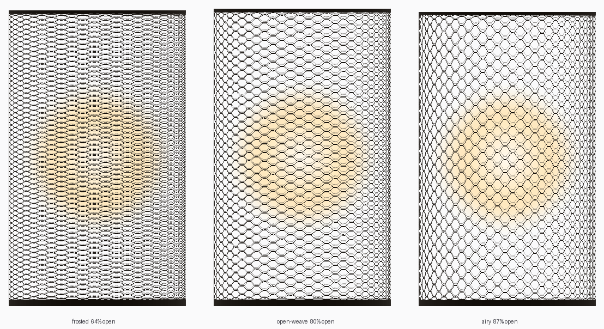
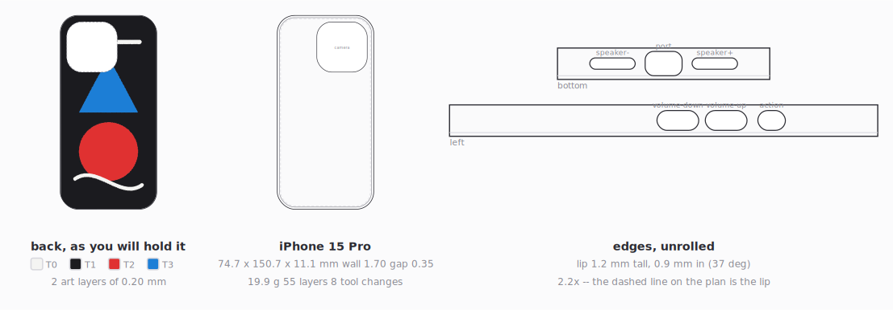

# Weave Trial

Two generators that write g-code directly, with no slicer in the loop: a
**see-through woven lamp shade**, below, and a **parametric iPhone case** you
paint with your AMS — [docs/phone-case.md](docs/phone-case.md).

---

# The lamp shade

A see-through woven lamp shade, generated as g-code and printed as **one
continuous bead** that climbs in a wave and welds to itself on the way past.
No slicer, no layers, no supports, no vase mode.



The shade is roughly **80% open air** at the default setting. You can see the
bulb through it.

```bash
python generate.py --lamp test-ring --out out/test.gcode   # 40 mm, ~25 min
python generate.py --lamp open-weave --preview out/lamp.svg
```

Print `test-ring` first. It is the same weave at a fifth of the height, and it
tells you in twenty minutes whether your flow and cooling are right.

---

## How the weave works

The nozzle walks a spiral whose height oscillates as it goes around:

```
z(theta) = centreline(theta) + a * sin(w * theta)
```

`w`, the waves per turn, is a **half**-integer — 30.5, not 30. That half wave
is the entire trick. After one full revolution the sine has advanced by an odd
multiple of pi, so it comes back **inverted**: turn `k+1` troughs exactly where
turn `k` crests. The vertical gap between them is

```
gap(theta) = step - (a_k + a_k+1) * sin(w * theta)
```

which sweeps from a wide open diamond down to zero and back, twice per wave.
Where it reaches zero the two turns weld — 61 welds per revolution at the
default. Between the welds, an open lens-shaped hole. That is the weave, and
it is why the shade is rigid despite being mostly air.

### The two dials, and why they are separate

**`rise_per_turn`** — how far the spiral climbs per revolution. This alone
decides how see-through the shade is, because each revolution lays exactly one
bead into each `rise_per_turn` of wall height:

```
open area = 1 - bead_height / rise_per_turn
```

At the 2.2 mm default with a 0.45 mm bead, that is 80% open. Use `--open` to
set it by the number you actually care about.

**`weld_overlap`** — how far the nozzle dips below the previous turn at a weld,
which sets how strongly the two fuse. The amplitude follows from it:
`a = (rise + overlap) / 2`.

### The thing that breaks this print

It is very tempting to crank the amplitude up for bigger holes. **That does not
work, and it is the failure that wrecks the print.** The turns do not merely
touch harder. The descending half of turn `k+1` carries on down *past* turn `k`
and keeps going, so the nozzle ends up travelling underneath a bead it laid a
revolution ago, with that bead sitting directly over the nozzle shaft. It
catches, and the print comes off the plate.

The safe regime is a shallow dip — about one bead height or less — so a weld is
an ordinary squish rather than a crash. **Bigger holes come from raising
`rise_per_turn`, never from raising the amplitude.**

Two things enforce that rather than just documenting it:

- The centreline is **solved, not shaped**. `step()` in `weave/geometry.py`
  pins the deepest point of every weld to exactly `-weld_overlap` and solves
  for the climb, so the transition turns hold the same weld depth as the
  middle of the shade. Hand-picked ramp curves cannot do this — they leave the
  fade-in and fade-out turns either floating apart or ploughing in.
- `check_support()` re-measures the **generated path**, comparing every sample
  against the point one revolution earlier. It reports the deepest dip, the
  longest unsupported bridge, and any revolution that never touches the one
  below it. `generate.py` refuses to write g-code when that check fails.

```
$ python generate.py --lamp open-weave --check-only
open-weave: 152 mm tall, 90 mm across
  open area      80%  (holes up to 4.8 mm tall)
  weave          30.5 waves/turn, 61 welds/turn, 29deg slope
  bead           39 m, 6 g, 36902 points
  weld dip       0.32 mm (bead is 0.45 mm)
  longest bridge 7.9 mm unsupported
  printability   OK
```

---

## Shades

| preset | size | open | notes |
|---|---|---|---|
| `open-weave` | 150 x 90 mm | 80% | the default; see-through and still rigid |
| `airy` | 150 x 90 mm | 87% | wide diamonds, longer bridges, print it slow |
| `frosted` | 150 x 90 mm | 64% | fine slits, soft even glow, no visible bulb |
| `table-shade` | 110 x 120 mm | 81% | short and wide, slight taper |
| `pendant` | 180 x 110 mm | 81% | tapered with a waist |
| `test-ring` | 40 x 60 mm | 80% | print this first |

`python generate.py --list` also lists the printers and materials.

Anything can be overridden: `--height --radius --top-radius --belly --open
--rise --waves --overlap --bead --nozzle`. `--waves` must end in `.5`; a whole
number stacks the waves instead of weaving them, and is rejected.

`--open` retunes the shade and then **re-measures** it, packing the waves
tighter if opening it up has stretched the unsupported bridges past 12 mm.
Above about 90% open the technique runs out and the check starts failing, which
is the honest answer rather than a shade that droops.

---

## Printing it

Single wall, no infill, no supports — there is nothing for a slicer to decide.
**Do not open the g-code in a slicer.** It is a non-planar path; re-slicing it
flattens it back into layers and you lose the weave.

| setting | value |
|---|---|
| nozzle | 0.4 mm |
| bead | 0.45 x 0.45 mm, round, in free air |
| weave speed | 14–18 mm/s — this is the one that matters |
| fan | 100% over the whole weave, off for layer 1 |
| foot / rim | 3 solid walls, 0.25 mm layers |
| material | translucent PLA is easiest; PETG is tougher but droops more |

The free-air spans are the whole game. Each bead crosses up to about 8 mm of
open air before it reaches its next weld, so it has to set before it sags:
**slow, and full cooling.** If the bridges droop, drop the weave speed before
you touch anything else.

The foot and rim are ordinary stacked walls, so the shade starts and ends
solid and has something to stand on and something to clamp a fitting to.

Use an **LED bulb.** The shade is thin plastic and it is not a heat shield.

---

## Provenance

The technique here was worked out from the geometry, not transcribed from a
source. The r/FullControl post that prompted it could not be read from the
environment this was built in (the network policy blocks reddit.com), so if
that post specifies particular parameters, they are not reflected here — treat
the numbers as independently derived and check them against it.

FullControl itself is optional and only used by `--fullcontrol`, which emits
the same geometry through `fc.transform` for its viewer and printer library.
The default writer is the built-in one, which is what knows about the
per-bead extrusion heights the fade regions need.

---

# The phone case

```bash
python case.py --list
python case.py --phone iphone-16-pro --test-fit            # print this first
python case.py --phone iphone-16-pro --art logo.svg --palette duo
python case.py --phone iphone-17-pro --no-gcode --stl case.stl
```



A case for any of eighteen iPhones, written straight to multi-tool g-code
with your SVG painted onto the outside of the back by the AMS. It prints back
face down, so the artwork is layer 1 against the build plate — the flattest
surface the printer can make, and the one face you cannot see while it
prints, which is why the generator mirrors the drawing for you.

```
$ python case.py --phone iphone-15-pro --art logo.svg --palette primary
iphone-15-pro / snug: 74.7 x 150.7 x 11.1 mm
  fit            0.35 mm gap, wall 1.70 mm (4 perimeters at 0.425 mm)
  back plate     1.30 mm, 6 layers, artwork on the first 2
  lip            1.20 mm tall, 0.90 mm in (37 deg overhang)
  cutouts        camera, port, speaker-, speaker+, power, volume-up, ...
  body colour    T1 ink #1b1b1f  (the artwork's main colour)
  filament       19.9 g + 1.5 g purged
  tool changes   8 (tower 46 x 40 mm, 3 layers)
  printability   OK
```

Three things it does that are worth knowing about:

**The section is solved, not drawn.** Each cross-section is a signed distance
field and every perimeter is an isocontour of it, so the perimeters *turn and
run around* the camera opening and the buttons instead of being severed at
them. The wall is always filled exactly, the test fit's rim follows the holes
for free, and the skirt is the same contour at a positive level.

**It builds its own purge tower, and only where one is needed.** Nothing
downstream is going to, and a tool change leaves the old colour in the melt
zone. Artwork on the back plate changes colour twice and never again, so the
tower is three layers tall and costs 1.5 g rather than outweighing the case.

**There is an STL too.** `--stl` builds the same case as a solid, from the
same dimensions rather than traced off the toolpath, for slicing yourself or
painting in your slicer's own colour tool. Not by marching a grid through it
— a case is flat faces and straight walls, and a grid turns a back plate that
wants a hundred triangles into three hundred thousand. Tubes of rounded
rectangles and convex prisms instead: two thousand triangles, a tenth of a
megabyte, and one optional dependency doing the boolean.

**The SVG reader is stdlib.** Every path command including arcs, nested
transforms, inherited fill, and strokes converted to fills — because plenty
of line art has no fills at all. It tells you what it could not read
(`<text>`: convert it to paths) and which of your colours merged onto the
same slot.

The camera *shape* is per phone, not one generic hole: a square island for
the 13–16 Pro, a vertical pill for the 15/16, and for the 17 Pro the bar
across the full width of the back, which a corner island would cover two
lenses of. The body dimensions are published specs. **The camera openings and
button positions are estimates and have not been measured against a real
phone** —
`--test-fit` prints the walls and a rim of back plate for half the filament
so that finding out costs twenty minutes. Full documentation:
[docs/phone-case.md](docs/phone-case.md).

There is a browser front end for it, at
[3-d-print-sandbox.vercel.app/case](https://3-d-print-sandbox.vercel.app/case):
pick a phone, drop in an SVG, watch the back redraw, download the g-code. It
runs a vendored copy of `phonecase/` living in
[ttvv-7/3D-print-sandbox](https://github.com/TTVV-7/3D-print-sandbox), so a
fix here has to be copied across -- that repo's `src/case_app.py` records
which commit its copy came from.

---

# Layout

```
generate.py                    lamp CLI
weave/geometry.py              the weave: centreline solver + check_support
weave/gcode.py                 g-code writer (no dependencies)
weave/profiles.py              printers, materials, shade presets
weave/preview.py               SVG preview: elevation, detail, lit
weave/fullcontrol_backend.py   optional: emit via FullControl instead
tests/test_weave.py            34 tests, incl. the crash mode above

case.py                        phone case CLI
phonecase/spec.py              phones, cases, cutouts, check_case
phonecase/shapes.py            the little slicer: SDF, marching squares, infill
phonecase/toolpath.py          layers, perimeters, colour, ordering
phonecase/svgart.py            SVG -> filled polygons (stdlib only)
phonecase/paint.py             palette, rasteriser, splitting a path by colour
phonecase/gcode.py             multi-tool writer and the purge tower
phonecase/solid.py             the case as a mesh, and a binary STL
phonecase/preview.py           SVG preview: back, plan, edges
phonecase/profiles.py          printers, filaments, palettes, case presets
tests/test_case.py             173 tests
```

The two packages share no code on purpose. They are two generators that
happen to live in one repository; coupling them would mean every change to a
printer profile had to be right for both.

```bash
python -m pytest tests -q
```
