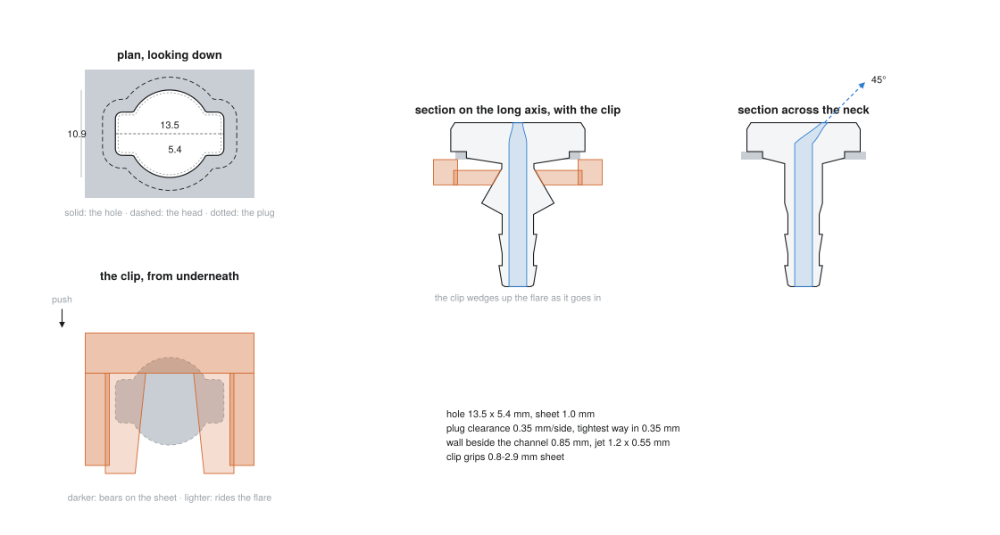

# Washer nozzle

A replacement windshield washer nozzle, generated from the hole it has to fit.
No CAD: the hole is a distance field, every cross-section of the part is an
offset of it, and the whole solid is a stack of those sections written straight
out as STL.

```bash
python nozzle.py --check-only
python nozzle.py --part gauge --out out/gauge.stl     # print this one first
python nozzle.py --part all   --out out/plate.stl --preview out/nozzle.svg
```



---

## The hole

Two caliper readings and a photograph, which do not entirely agree:

| | |
|---|---|
| long axis | **13.5 mm** (caliper) |
| across the neck | **5.4 mm** (caliper) |
| across the lobes | **10.9 mm** (photo, 0.81 x the length) |
| how far the lobes run | **10.1 mm** (photo, 0.75 x the length) |
| sheet thickness | **not measured — measure it** |

The photograph, thresholded and flood filled, gives the outline as ratios:
neck 0.44 of the length, lobes 0.81, lobes running over 0.75. Scale those by
the 13.5 mm reading and the neck comes out at 5.9 mm, not 5.4. That gap is what
you get when outside jaws are used inside a hole — the jaw tips are perhaps
0.25 mm thick each — so **the hole is known to about half a millimetre, and no
better.**

That is not a reason to guess. It is the reason `--part gauge` exists: five
tabs cut to the outline at 0.4 mm steps of overall length, numbered, on one
handle. Push each into the hole, take the largest that drops in without
forcing, and feed it back:

```bash
python nozzle.py --length 13.9 --panel 1.2 --part all --out out/plate.stl
```

Everything downstream — plug, head, clip, flare — re-cuts from that number.

The outline itself is two rounded rectangles crossed: a long thin one for the
slot, and a short fat one whose corner radius equals its own half width, so it
is a stadium, for the lobes. Both have exact distance functions, which is what
makes `offset -0.35` the plug and `offset +1.6` the head rather than two
separately drawn shapes that have to be kept in agreement by hand.

## Why it is held in with a wedge and not a snap

The obvious design is the factory one: two sprung arms that squash going
through the hole and spring out underneath. Work out the strain and it does not
survive the trip. An arm has to deflect about a millimetre, and everything
above the sheet is 1 mm of plug and 3.6 mm of head, so the arm can only be
about 5 mm long. Peak surface strain in a cantilever is

```
e = 3 t d / (2 L^2)  =  3 x 1.3 x 1.0 / (2 x 25)  =  7.8%
```

against roughly 2-3% before PETG cracks and rather less for PLA across layer
lines. A printed snap arm that short is a printed snap arm that snaps.

So the part goes in from above and a separate clip goes on from below — you are
under there connecting the hose anyway. Under the sheet the shank pinches to a
waist and then **flares back out going down**, and the clip is a flat plate
with a tapered notch that slides onto that flare. Push it in and the notch
narrows, so it rides further up the cone and clamps harder. One clip covers
**0.8 to 2.9 mm of sheet** with no adjustment; the wedge takes up whatever the
sheet turns out to be.

Two angles do double duty and that is deliberate:

- **The flare, 30 degrees from vertical**, is both the ramp the clip climbs and
  the only real overhang on the shank when the part is printed head down.
- **The notch taper, 6 degrees a side**, sets how much the clip rises per
  millimetre of travel — about 0.3 — and stays well inside the self locking
  angle, so it does not walk back out.

The prong's inner face is cut at the flare angle, so it meets the cone face to
face instead of digging an edge into it, and the step between the part of the
clip that touches the sheet and the prongs is `taper + waist - 0.2`, which is
exactly deep enough for the prongs to pass under the plug whatever the sheet
thickness. `test_the_prongs_clear_the_waist` is that sentence as an assertion.

## Why there is no boolean anywhere

The fluid channel is not subtracted from the body. The body *is* a tube: an
outer stack of rings, an inner stack of rings, quad strips between each, and an
annulus at each end. A tube built that way is closed and two-manifold by
construction, so the one part of this that absolutely must not leak cannot leak
because of a mesh fault.

The jet falls out of the same trick. Above the plenum the channel's centre
walks sideways at the aim angle while the round bore squashes into a slot, and
because the rings stay horizontal, the ring at the top of the head *is* the
oblique cut through a tilted tube — which is the opening in the top face, with
no cutting operation performed.

The clip and the gauge are several overlapping closed solids in one file. Every
slicer unions those; `Mesh.check()` knows it, and checks each solid separately
rather than reporting two boxes sharing a face as a fault.

## What the check refuses

`nozzle.py` will not write an STL that fails `check_fit`, the same way
`generate.py` will not write g-code for a weave that does not weld:

```
$ python nozzle.py --check-only
hole 13.5 x 5.4 mm (10.9 over the lobes), 1.0 mm sheet
  goes in        0.35 mm to spare at the tightest point
  head           covers the hole by 1.6 mm all round
  clip           grips 0.8-2.9 mm sheet, 12 mm of travel
  channel        2.2 mm bore, 0.85 mm wall beside it
  jet            1.2 x 0.55 mm at 45 deg, 0.66 mm2
  printing       45 deg worst overhang, 0.40 mm worst ledge, head face down
  nozzle         1.25 g, 5760 triangles
  fit            OK
```

- **goes in** — every section below the head is compared with the hole, angle by
  angle. The whole part is rigid and goes in from above, so anything below the
  head that is wider than the hole makes the part unfittable. This is the check
  that catches a bigger hose barb.
- **wall beside the channel** — the channel is measured against the outer skin
  at 0.25 mm intervals up the part. The lead-in chamfer on the barb tip is
  excluded and reported separately; it is thin on purpose and carries nothing.
- **printing** — measured off the triangles that actually get written, not off
  the change in radius: where a section is not round, a radial step is not the
  surface slope. Anything past 45 degrees is refused.

  The default aim of 45 degrees puts the part exactly on that limit, and it is
  the channel that is on it: the roof of a tilted bore is an overhang of the
  tilt angle, no matter how gradually the tilt is reached. That is fine at 45 —
  each layer is half supported by the one under it — and the tilted run is only
  2.6 mm, but it is also the reason the limit is where it is. There is no
  supporting the inside of a 2.2 mm hole, so a steeper aim is refused rather
  than printed badly. `--preset shallow` throws at 35 degrees if you would
  rather have the margin.
- **clip** — the sheet thickness range the wedge can reach, and whether the one
  you asked for is inside it.

## Printing

| setting | value |
|---|---|
| material | **PETG, ASA or PP. Not PLA** |
| orientation | head face down on the plate — this is what `--part` emits |
| supports | none |
| layers | 0.15-0.2 mm |
| walls | 4 perimeters, 100% infill (the part is 5 mm across; it is all wall) |

PLA is the wrong choice twice over. A dark part on a hood in the sun goes past
its glass transition and droops, and washer fluid is mostly methanol, which
attacks it. PETG is the easy answer; PP if you have it dialled in.

The head prints face down for three reasons: the visible face comes off the
plate glass smooth, the jet is a hole in the first layer instead of a bridge,
and every downward face on the shank becomes an upward one — which is why the
flare and the head chamfer are the only overhangs left.

Print the **gauge** first. It is 20 minutes and it is the difference between one
nozzle and four.

## Fitting

1. Push the nozzle in from above until the head sits down on the paint. The
   lobes are what stop it turning, so it can only go in one way round.
2. From underneath, slide the clip onto the shank, arms first, until it is firm.
   It wedges; it should need a push.
3. Push the hose on. The barb is sized for 4 mm bore — `--hose-id` if yours is
   different, and the check will tell you if that makes it too fat for the hole.
4. Aim it. The default is 45 degrees from vertical, which is what the nozzle
   that came off the car threw; `--aim` changes it. `--aim-az` is which way it
   points, 0 being square across the neck of the hole. **Which way that is on
   the car, the photographs do not say** — look at where the hole's long axis
   runs before you print, and reprint with `--aim-az 180` if it sprays at the
   wrong end of the glass.

The head sits on paint, not on a gasket. If it needs to be watertight, a smear
of silicone under the head does it; the clip will still pull it down.

## What is not modelled

- **No fan pattern.** The jet is a plain slot, so it throws a narrow fan or a
  stream, not the wide sheet an OEM fluidic nozzle makes. Fluidic nozzles work
  by oscillating a jet inside a shaped cavity and that is not printable at this
  size.
- **No heater.** If the car had a heated nozzle, this is not one.
- **The sheet thickness is a guess** until you measure it. It is the only
  dimension in the whole part that nothing else can be derived from.
